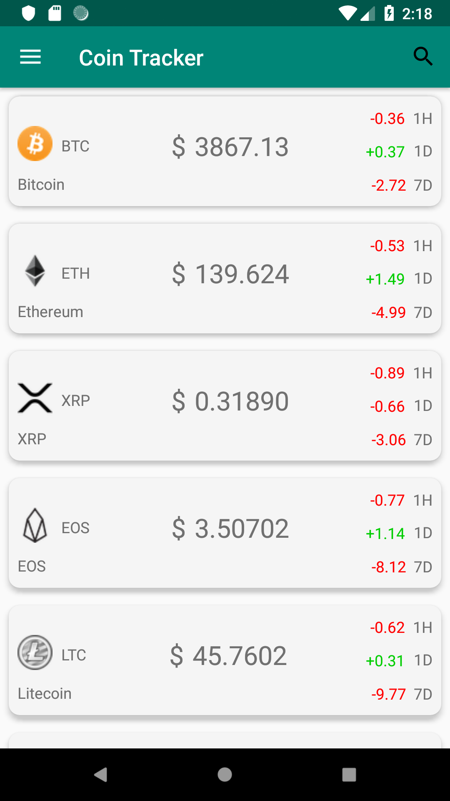
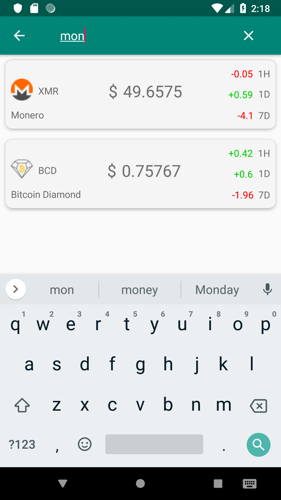
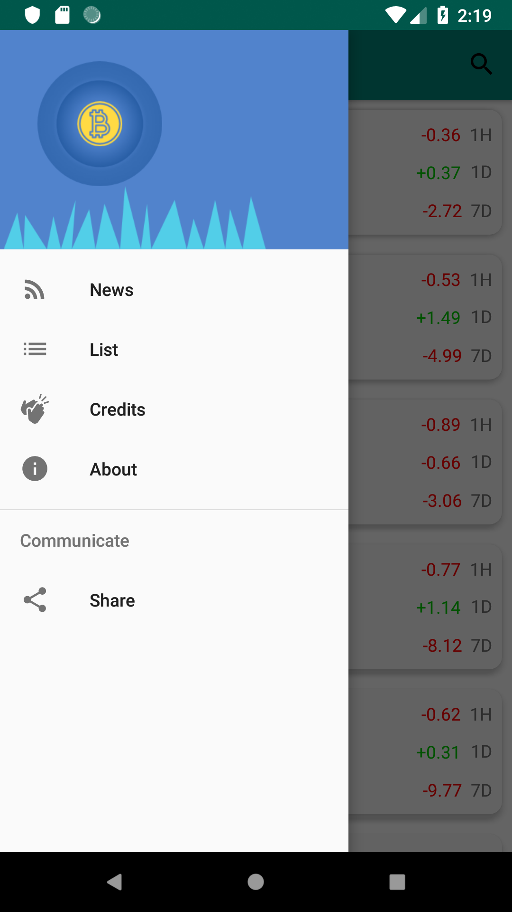

# CoinTracker
Cryptocurrencies tracker
Mastering android architecture components by building a real-time cryptocurrency coin tracking app and a news feed.

# Architecture - MVVM

Diagram : Android Architecture Diagram

Cryptocurrency data via [coinmarketcap.com](https://coinmarketcap.com/)  
News feed via [nytimes.com](https://www.nytimes.com/section/science)
